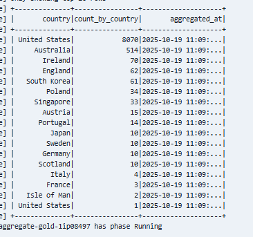
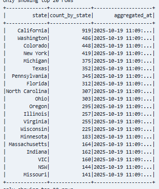
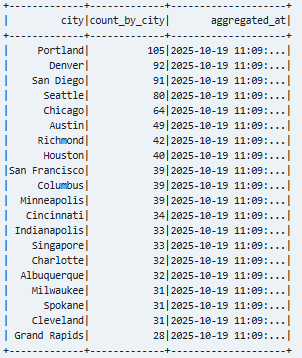
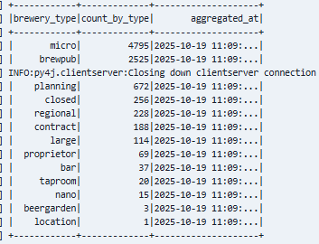

# Brewery DB Data Pipeline

This project implements a **medallion architecture** (Bronze → Silver → Gold) to ingest, transform, and serve data from the [Open Brewery DB API](https://www.openbrewerydb.org/documentation). The pipeline is orchestrated with **Apache Airflow**, containerized with **Docker**, deployable on **Kubernetes**.

---

## 🌐 Data Source

- **API**: `https://api.openbrewerydb.org/v1/breweries`
- **Metadata endpoint**: `https://api.openbrewerydb.org/v1/breweries/meta`
- **Pagination**: Up to 200 records per page
- **Total records**: ~10,000 breweries (as of 2025)

---

# Brewery DB Data Pipeline

This project implements a **medallion architecture** (Bronze → Silver → Gold) to ingest, transform, and serve data from the [Open Brewery DB API](https://www.openbrewerydb.org/documentation). The pipeline is orchestrated with **Apache Airflow**, containerized with **Docker**, deployable on **Kubernetes**, and monitored via **Grafana**.

Default credentials to access Airflow UI:
```bash
_AIRFLOW_WWW_USER_USERNAME: airflow
_AIRFLOW_WWW_USER_PASSWORD: airflow
```
---

## 🌐 Data Source

- **API**: `https://api.openbrewerydb.org/v1/breweries`
- **Metadata endpoint**: `https://api.openbrewerydb.org/v1/breweries/meta`
- **Pagination**: Up to 200 records per page
- **Total records**: ~10,000 breweries (as of 2025)

---


### Layers

- **Bronze**: Raw JSON responses from the API, partitioned by ingestion date.
- **Silver**: Cleaned, deduplicated, strongly-typed Parquet files with schema enforcement and a `processed_at` timestamp.
- **Gold**: (Future) Business-ready aggregations (e.g., count by state, brewery type distribution).

All data is stored in a **PersistentVolume** (`/tmp/brewery-data` on your host) for local development.

---

## 🧪 Key Features

- ✅ **Idempotent daily ingestion** (partitioned by date)
- ✅ **PySpark-based transformation** (scalable, schema-on-read + schema enforcement)
- ✅ **Snappy-compressed Parquet** output for efficient storage and query performance
- ✅ **Unit tests** for ingestion and transformation logic
- ✅ **Airflow DAG** using `KubernetesPodOperator` for task isolation
---

## 📦 Project Structure

```bash
brewery-data-pipeline/
├── airflow/                     # Airflow DAGs + docker-compose
│   ├── dags/
│   │   └── brewery_pipeline.py  # Main DAG
│   └── docker-compose.yaml      # Local Airflow + Postgres + Redis
├── etl/                         # Data pipeline code
│   ├── src/
│   │   ├── api_to_bronze.py     # Ingests API → JSON (Bronze)
│   │   ├── transform_bronze_to_silver.py
│   │   └── aggregated_silver_to_gold.py
│   └── tests/                   # Unit tests
├── k8s/                         # Kubernetes manifests
│   ├── pv-pvc.yaml              # PersistentVolume for data
│   └── airflow-rbac.yaml        # RBAC for Airflow pods
├── Dockerfile                   # Builds pipeline image
├── requirements.txt             # Python dependencies
└── README.md
``` 

## 📦 Automate Setup with MakeFile

```bash
	make all             - Setup all (build, infra, Airflow, DAGs)
	make build-image     - build Docker image
	make apply-k8s       - Apply PV/PVC/RBAC in Kubernetes cluster
	make start-airflow   - Start Airflow, Postgres, Grafana
	make copy-dags       - Update DAG in Airflow
	make test            - Run unit and integration tests
	make status          - Show status of cluster and containers
	make stop            - Stop everything
```

## 🌐 Deploy on Cloud

Following the instructions for setup on Google Cloud Plataform

- **IAM permissions**: roles/container.admin, roles/storage.admin, roles/composer.admin and roles/logging.admin

Create a GKE Cluster
```bash
gcloud config set project YOUR_PROJECT_ID

gcloud container clusters create brewery-cluster \
  --zone us-central1-a \
  --num-nodes 3 \
  --machine-type e2-medium \
  --enable-autoscaling --min-nodes 1 --max-nodes 5
```

Create a Cloud Storage Bucket
```bash
gsutil mb -l us-central1 gs://brewery-data-YOUR_PROJECT_ID

# This for replace the local PersistentVolume
```

Update Your Code for Cloud Storage

```bash
# Instead of:
bronze_path = Path(data_root) / f"medallion/bronze/breweries/{execution_date}"
silver_path = Path(data_root) / f"medallion/silver/breweries/{execution_date}"
gold_path = Path(data_root) / f"medallion/gold/breweries_agg/{execution_date}"

# Use:
bronze_path = "gs://brewery-data-YOUR_PROJECT_ID/medallion/bronze/..."
silver_path = "gs://brewery-data-YOUR_PROJECT_ID/medallion/silver/..."
gold_path = "gs://brewery-data-YOUR_PROJECT_ID/medallion/gold/..."
```

Build and Push Docker Image to Artifact Registry

```bash
gcloud auth configure-docker us-central1-docker.pkg.dev

docker build -t brewery-pipeline:latest .

docker tag brewery-pipeline:latest \
  us-central1-docker.pkg.dev/YOUR_PROJECT_ID/brewery-repo/brewery-pipeline:latest
docker push us-central1-docker.pkg.dev/YOUR_PROJECT_ID/brewery-repo/brewery-pipeline:latest
```

Deploy Airflow with Composer Environment (Recommended)
```bash
gcloud composer environments create brewery-composer \
  --location us-central1 \
  --zone us-central1-a \
  --image-version composer-3.1.0-airflow-2.10.0
```

Configure Monitoring (Optional)

```bash
Use Cloud Monitoring + Cloud Logging
```

## 🌐 Results








